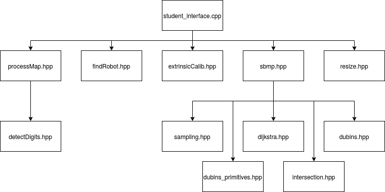
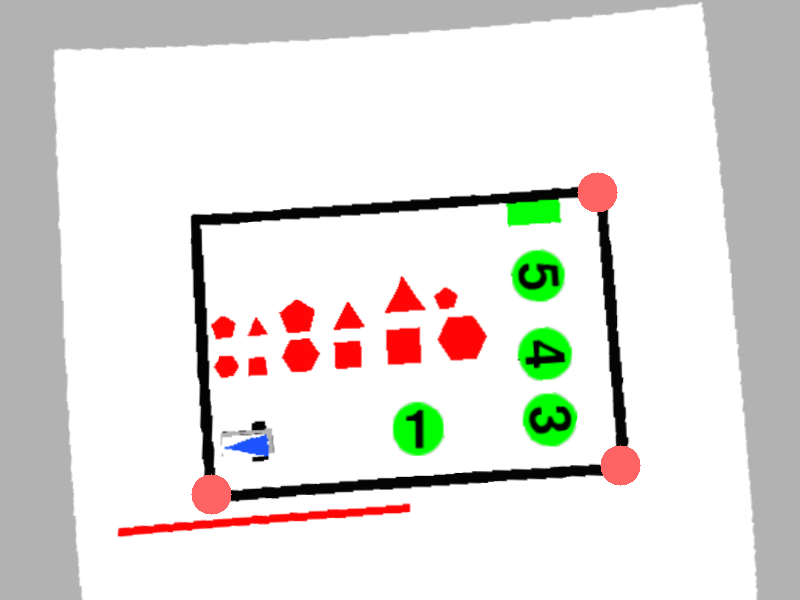
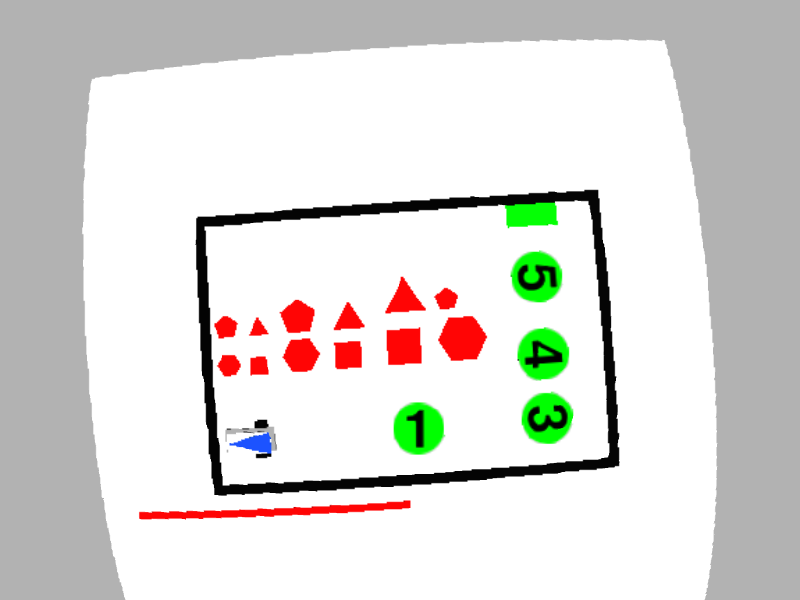

# Summary of implemented functions 

---

## Authors: Luca Caronti, Riccardo Scilla

---

   
<p!>

---

In this file there are only the main functions. To see more deeply how they are implmented consult:

* [Extrinsic Calibration doc](doc/extrinsicCalib.md)
* [Process Map doc](doc/processMap.md)
* [Sampling doc](doc/samplig.md)
* [Sampling Based Motion Planning doc](doc/sbmp.md)
* [Find Robot doc](doc/findRobot.md)
* [Dijkstra doc](doc/dijkstra.md)

---

 Main Functions                        | Descriptions                                
--------------------------------|---------------------------------------------
`void `[`loadImage`](#namespacestudent_1a3117c968a47bf95f86bdb813a3b64e56)`(cv::Mat & img_out,const std::string & config_folder)`            | This function can be used to replace the simulator camera and test the developed pipeline on a set of custom image.
`void `[`genericImageListener`](#namespacestudent_1a3b726e7af03a643c06dcde23057a82ea)`(const cv::Mat & img_in,std::string topic,const std::string & config_folder)`            | Generic listener used from the image listener node.
`bool `[`extrinsicCalib`](#namespacestudent_1a6103f938ce28f8820c48c089d5f95098)`(const cv::Mat & img_in,std::vector< cv::Point3f > object_points,const cv::Mat & camera_matrix,cv::Mat & rvec,cv::Mat & tvec,const std::string & config_folder)`            | Finds arena pose from 3D(object_points)-2D(image_in) point correspondences.
`void `[`imageUndistort`](#namespacestudent_1aceb2a29362b8223a9d3601d9496e1c98)`(const cv::Mat & img_in,cv::Mat & img_out,const cv::Mat & cam_matrix,const cv::Mat & dist_coeffs,const std::string & config_folder)`            | Transforms an image to compensate for lens distortion. 
`void `[`findPlaneTransform`](#namespacestudent_1a528d33658d0d4d982a46f18b7abb4a70)`(const cv::Mat & cam_matrix,const cv::Mat & rvec,const cv::Mat & tvec,const std::vector< cv::Point3f > & object_points_plane,const std::vector< cv::Point2f > & dest_image_points_plane,cv::Mat & plane_transf,const std::string & config_folder)`            | Calculates a perspective transform from four pairs of the corresponding points. 
`void `[`unwarp`](#namespacestudent_1a6b8caf348979f55e58a75193233c219d)`(const cv::Mat & img_in,cv::Mat & img_out,const cv::Mat & transf,const std::string & config_folder)`            | Applies a perspective transformation to an image. 
`bool `[`processMap`](#namespacestudent_1a153a17ef667d7c10b8f33d815b9bc1bc)`(const cv::Mat & img_in,const double scale,std::vector< Polygon > & obstacle_list,std::vector< std::pair< int, Polygon >> & victim_list,Polygon & gate,const std::string & config_folder)`            | Process the image to detect victims, obtacles and the gate 
`bool `[`findRobot`](#namespacestudent_1afd56b779672a672e15ac45dc927b8a6b)`(const cv::Mat & img_in,const double scale,Polygon & triangle,double & x,double & y,double & theta,const std::string & config_folder)`            | Process the image to detect the robot pose
` bool planPath(const Polygon& borders, const std::vector<Polygon>& obstacle_list,  const std::vector<std::pair<int,Polygon>>& victim_list,  const Polygon& gate, const float x, const float y, const float theta,  Path& path, const std::string& config_folder)` | Plan the path according to chosen mission.

## Main functions

---

#### `void `[`loadImage`](#namespacestudent_1a3117c968a47bf95f86bdb813a3b64e56)`(cv::Mat & img_out,const std::string & config_folder)` 

This function can be used to replace the simulator camera and test the developed pipeline on a set of custom image.

##### Parameters
* `image_out [out]` The loaded raw image 

* `config_folder [in]` A custom string from config file.

---

#### `void `[`genericImageListener`](#namespacestudent_1a3b726e7af03a643c06dcde23057a82ea)`(const cv::Mat & img_in,std::string topic,const std::string & config_folder)` 

Generic listener used from the image listener node.

##### Parameters
* `image_in [in]` Input image to store 

* `topic [in]` Topic from where the image is taken 

* `config_folder [in]` A custom string from config file.

---

#### `bool `[`extrinsicCalib`](#namespacestudent_1a6103f938ce28f8820c48c089d5f95098)`(const cv::Mat & img_in,std::vector< cv::Point3f > object_points,const cv::Mat & camera_matrix,cv::Mat & rvec,cv::Mat & tvec,const std::string & config_folder)` 

Finds arena pose from 3D(object_points)-2D(image_in) point correspondences.

##### Parameters
* `image_in [in]` Input image to store 

* `object_points [in]` 3D position of the 4 corners of the arena, following a counterclockwise order starting from the one near the red line. 

* `camera_matrix [in]` 3x3 floating-point camera matrix 

* `rvec [out]` Rotation vectors estimated linking the camera and the arena 

* `tvec [out]` Translation vectors estimated for the arena 

* `config_folder [in]` A custom string from config file. 

##### Returns
`[bool]` false if there are some errors, true otherwise

##### Operations done

1. Check if file `[config_folder]/extrinsicCalibData.csv` exists.
   1. If file exists so it's read with funtion `readCSV`
   2. If file doesn't exist:
      1. `selectNpoints` function is called. (You must press your left key of mouse and select the 4 corners in counterclockwise, starting from the lower left corner)
      
      2. Once N points are been selected, they are saved into CSV file thanks to function `writePointsCSV`
2. `cv::solvePnp` funtion is called.

__To see a more accurate description consult__ [Extrinsic Calibration doc](doc/extrinsicCalib.md).

---

#### `void `[`imageUndistort`](#namespacestudent_1aceb2a29362b8223a9d3601d9496e1c98)`(const cv::Mat & img_in,cv::Mat & img_out,const cv::Mat & cam_matrix,const cv::Mat & dist_coeffs,const std::string & config_folder)` 

Transforms an image to compensate for lens distortion. 
##### Parameters
* `image_in [in]` distorted image 

* `image_out [out]` undistorted image 

* `camera_matrix [in]` 3x3 floating-point camera matrix 

* `dist_coeffs [out]` distortion coefficients [k1,k2,p1,p2,k3] 

* `config_folder [in]` A custom string from config file.

##### Results
1. Distorted image

2. Undistorted image

---

#### `void `[`findPlaneTransform`](#namespacestudent_1a528d33658d0d4d982a46f18b7abb4a70)`(const cv::Mat & cam_matrix,const cv::Mat & rvec,const cv::Mat & tvec,const std::vector< cv::Point3f > & object_points_plane,const std::vector< cv::Point2f > & dest_image_points_plane,cv::Mat & plane_transf,const std::string & config_folder)` 

Calculates a perspective transform from four pairs of the corresponding points. 
##### Parameters
* `camera_matrix [in]` 3x3 floating-point camera matrix 

* `rvec [in]` Rotation vectors estimated linking the camera and the arena 

* `tvec [in]` Translation vectors estimated for the arena 

* `object_points_plane [in]` 3D position of the 4 corners of the arena, following a counterclockwise order starting from the one near the red line. 

* `dest_image_points_plane [in]` destinatino point in px of the object_points_plane 

* `plane_transf [out]` plane perspective trasform (3x3 matrix) 

* `config_folder [in]` A custom string from config file.

---

#### `void `[`unwarp`](#namespacestudent_1a6b8caf348979f55e58a75193233c219d)`(const cv::Mat & img_in,cv::Mat & img_out,const cv::Mat & transf,const std::string & config_folder)` 

Applies a perspective transformation to an image. 
##### Parameters
* `image_in [in]` input image 

* `image_out [out]` unwarped image 

* `transf [in]` plane perspective trasform (3x3 matrix) 

* `config_folder [in]` A custom string from config file.

---

#### `bool `[`processMap`](#namespacestudent_1a153a17ef667d7c10b8f33d815b9bc1bc)`(const cv::Mat & img_in,const double scale,std::vector< Polygon > & obstacle_list,std::vector< std::pair< int, Polygon >> & victim_list,Polygon & gate,const std::string & config_folder)` 

Process the image to detect victims, obtacles and the gate 
##### Parameters
* `image_in [in]` input image 

* `scale [in]` 1px/scale = X meters 

* `obstacle_list [out]` list of obstacle polygon (vertex in meters) 

* `victim_list [out]` list of pair victim_id and polygon (vertex in meters) 

* `gate [out]` polygon representing the gate (vertex in meters) 

* `config_folder [in]` A custom string from config file.

##### Return
* `bool` True if one gate is found, otherwise return false

##### Description 
Process the image to detect victims, obtacles and the gate. 
__To see a more accurate description consult__ [Process Map doc](doc/processMap.md).

---

#### `bool `[`findRobot`](#namespacestudent_1afd56b779672a672e15ac45dc927b8a6b)`(const cv::Mat & img_in,const double scale,Polygon & triangle,double & x,double & y,double & theta,const std::string & config_folder)` 

Process the image to detect the robot pose 
##### Parameters
* `image_in [in]` input image 

* `scale [in]` 1px/scale = X meters 

* `x [out]` x position of the robot in the arena reference system 

* `y [out]` y position of the robot in the arena reference system 

* `theta [out]` yaw of the robot in the arena reference system 

* `config_folder [in]` A custom string from config file.

##### Returns
* `bool` true if the robot is found, false otherwise.

##### Descriptions
Process the image to detect the robot pose, finding the center and the orientation of the robot.
__To see a more accurate description consult__ [Find Robot doc](doc/findRobot.md).

---

#### `bool planPath(const Polygon& borders, const std::vector<Polygon>& obstacle_list,  const std::vector<std::pair<int,Polygon>>& victim_list,  const Polygon& gate, const float x, const float y, const float theta,  Path& path, const std::string& config_folder);`

Plan the path according to chosen mission.
##### Parameters

* `borders [in]`        border of the arena [m]
* `obstacle_list [in]`  list of obstacle polygon [m]
* `victim_list [in]`    list of pair victim_id and polygon [m]
* `gate [in]`           polygon representing the gate [m]
* `x [in]`              x position of the robot in the arena reference system
* `y [in]`              y position of the robot in the arena reference system
* `theta [in]`          yaw of the robot in the arena reference system
* `path [out]`          output path of planned path
* `config_folder [in]`  A custom string from config file.
##### Returns
* `bool` true if path is computed correctly, false otherwise

##### Description
To chose the mission to implment, uncomment one of the following `#define` and recompile the project:
* `#define MISSION_1`
* `#define MISSION_2`
* `#define MISSION_2_fast`

__MISSION 1:__ 
Victim are chosen in cresent order wrt their number. All victims are chosen.

__MISSION 2:__
* Consists on a brute force search, for each victims combination a path length is found
* For each number of victims a best result is taken (i.e. one path that picks one victim, one for 2 victims, one for 3 victim etc.)
* Starting with one victim with length , if the path picking up one more victim length is  this path is taken. The procedure is repeated, but at each iteration the margin in divided by two 

__MISSION 2 FAST:__

* For every victim in the map, compute:
   - distance from current point to victim 
   - distance from current point to gate 
   - distance from victim to gate 
* Select as next point the one that is closer to the current point () and does not worsen the distance to the gate by more than 10\%, i.e. .
* If no point satisfy this condition, the gate point is chosen as final point.
* This procedure is repeated until the gate is selected.

__To see how the path is computed see__ [Sampling Based Motion Planning doc](doc/sbmp.md)

---

