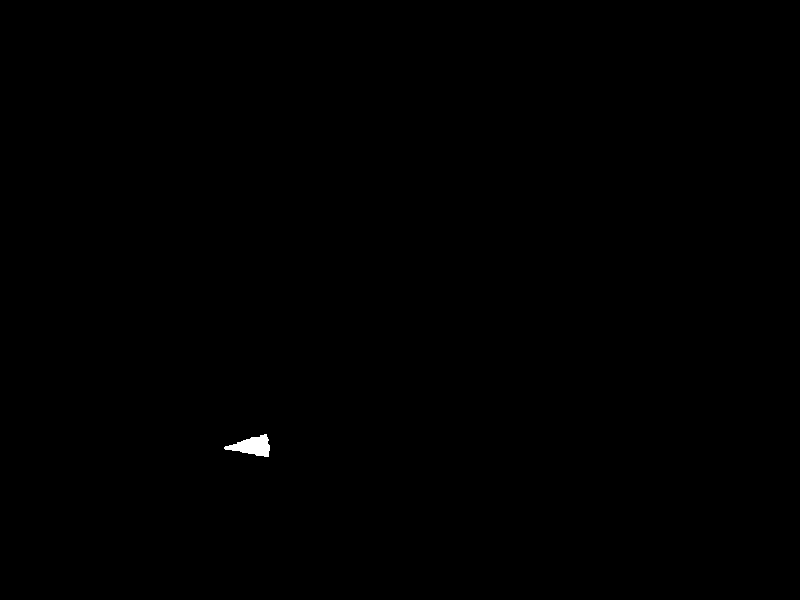
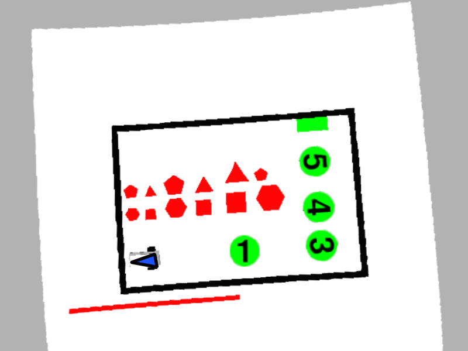
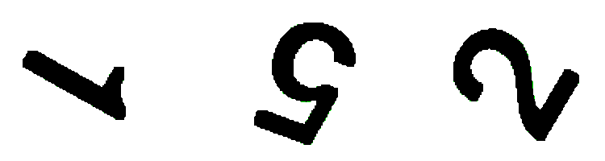

# Summary of implemented functions 

---

## Authors: Luca Caronti, Riccardo Scilla

---

 Members                        | Descriptions                                
--------------------------------|---------------------------------------------
`namespace `[`student`](#namespacestudent) | Implemented funtions
Extrinsic calib | Extrinsic calib support funtions
Find Robot | Find robot support funtions 

# namespace `student` 

## Summary

 Members                        | Descriptions                                
--------------------------------|---------------------------------------------
`public void `[`loadImage`](#namespacestudent_1a3117c968a47bf95f86bdb813a3b64e56)`(cv::Mat & img_out,const std::string & config_folder)`            | This function can be used to replace the simulator camera and test the developed pipeline on a set of custom image.
`public void `[`genericImageListener`](#namespacestudent_1a3b726e7af03a643c06dcde23057a82ea)`(const cv::Mat & img_in,std::string topic,const std::string & config_folder)`            | Generic listener used from the image listener node.
`public bool `[`extrinsicCalib`](#namespacestudent_1a6103f938ce28f8820c48c089d5f95098)`(const cv::Mat & img_in,std::vector< cv::Point3f > object_points,const cv::Mat & camera_matrix,cv::Mat & rvec,cv::Mat & tvec,const std::string & config_folder)`            | Finds arena pose from 3D(object_points)-2D(image_in) point correspondences.
`public void `[`imageUndistort`](#namespacestudent_1aceb2a29362b8223a9d3601d9496e1c98)`(const cv::Mat & img_in,cv::Mat & img_out,const cv::Mat & cam_matrix,const cv::Mat & dist_coeffs,const std::string & config_folder)`            | Transforms an image to compensate for lens distortion. 
`public void `[`findPlaneTransform`](#namespacestudent_1a528d33658d0d4d982a46f18b7abb4a70)`(const cv::Mat & cam_matrix,const cv::Mat & rvec,const cv::Mat & tvec,const std::vector< cv::Point3f > & object_points_plane,const std::vector< cv::Point2f > & dest_image_points_plane,cv::Mat & plane_transf,const std::string & config_folder)`            | Calculates a perspective transform from four pairs of the corresponding points. 
`public void `[`unwarp`](#namespacestudent_1a6b8caf348979f55e58a75193233c219d)`(const cv::Mat & img_in,cv::Mat & img_out,const cv::Mat & transf,const std::string & config_folder)`            | Applies a perspective transformation to an image. 
`public bool `[`processMap`](#namespacestudent_1a153a17ef667d7c10b8f33d815b9bc1bc)`(const cv::Mat & img_in,const double scale,std::vector< Polygon > & obstacle_list,std::vector< std::pair< int, Polygon >> & victim_list,Polygon & gate,const std::string & config_folder)`            | Process the image to detect victims, obtacles and the gate 
`public bool `[`findRobot`](#namespacestudent_1afd56b779672a672e15ac45dc927b8a6b)`(const cv::Mat & img_in,const double scale,Polygon & triangle,double & x,double & y,double & theta,const std::string & config_folder)`            | Process the image to detect the robot pose 

Members (privates)                      | Descriptions                                
--------------------------------|---------------------------------------------
`private bool `[`readCSV`](#extrinsicCalib_readCSV)`(std::fstream &file, std::vector<std::string> &string_vector, int &elements_for_line)`            |  This function raed a CSV file and returns a string vector with all elements and a variable 
`private void `[`writePointsCSV`](#extrinsicCalib_writePointsCSV)`(std::fstream &file, std::vector<cv::Point2f> points)`            |  Writes points into CSV file 
`private void `[`CallBackFunc`](#extrinsicCalib_CallBackFunc)`(int event, int x, int y, int flags, void *userdata)`            |  Call back funtion when mouse key is pressed on the image 
`private void `[`selectNpoints`](#extrinsicCalib_selectNpoints)`(const cv::Mat &image, std::vector<cv::Point2f> &allPoints, int num_points_to_take)`            |  This function allow to select with mouse pointer N points inside the image

## Members

---

#### `public void `[`loadImage`](#namespacestudent_1a3117c968a47bf95f86bdb813a3b64e56)`(cv::Mat & img_out,const std::string & config_folder)` 

This function can be used to replace the simulator camera and test the developed pipeline on a set of custom image.

##### Parameters
* `image_out [out]` The loaded raw image 

* `config_folder [in]` A custom string from config file.

---

#### `public void `[`genericImageListener`](#namespacestudent_1a3b726e7af03a643c06dcde23057a82ea)`(const cv::Mat & img_in,std::string topic,const std::string & config_folder)` 

Generic listener used from the image listener node.

##### Parameters
* `image_in [in]` Input image to store 

* `topic [in]` Topic from where the image is taken 

* `config_folder [in]` A custom string from config file.

---

#### `public bool `[`extrinsicCalib`](#namespacestudent_1a6103f938ce28f8820c48c089d5f95098)`(const cv::Mat & img_in,std::vector< cv::Point3f > object_points,const cv::Mat & camera_matrix,cv::Mat & rvec,cv::Mat & tvec,const std::string & config_folder)` 

Finds arena pose from 3D(object_points)-2D(image_in) point correspondences.

##### Parameters
* `image_in [in]` Input image to store 

* `object_points [in]` 3D position of the 4 corners of the arena, following a counterclockwise order starting from the one near the red line. 

* `camera_matrix [in]` 3x3 floating-point camera matrix 

* `rvec [out]` Rotation vectors estimated linking the camera and the arena 

* `tvec [out]` Translation vectors estimated for the arena 

* `config_folder [in]` A custom string from config file. 

##### Returns
`[bool]` false if there are some errors, true otherwise

##### Operations done

1. Check if file `[config_folder]/extrinsicCalibData.csv` exists.
   1. If file exists so it's read with funtion `readCSV`
   2. If file doesn't exist:
      1. `selectNpoints` function is called. (You must press your left key of mouse and select the 4 corners in counterclockwise, starting from the lower left corner)
      
      2. Once N points are been selected, they are saved into CSV file thanks to function `writePointsCSV`
2. `cv::solvePnp` funtion is called.

---

#### `public void `[`imageUndistort`](#namespacestudent_1aceb2a29362b8223a9d3601d9496e1c98)`(const cv::Mat & img_in,cv::Mat & img_out,const cv::Mat & cam_matrix,const cv::Mat & dist_coeffs,const std::string & config_folder)` 

Transforms an image to compensate for lens distortion. 
##### Parameters
* `image_in [in]` distorted image 

* `image_out [out]` undistorted image 

* `camera_matrix [in]` 3x3 floating-point camera matrix 

* `dist_coeffs [out]` distortion coefficients [k1,k2,p1,p2,k3] 

* `config_folder [in]` A custom string from config file.

##### Results
1. Distorted image

2. Undistorted image

---

#### `public void `[`findPlaneTransform`](#namespacestudent_1a528d33658d0d4d982a46f18b7abb4a70)`(const cv::Mat & cam_matrix,const cv::Mat & rvec,const cv::Mat & tvec,const std::vector< cv::Point3f > & object_points_plane,const std::vector< cv::Point2f > & dest_image_points_plane,cv::Mat & plane_transf,const std::string & config_folder)` 

Calculates a perspective transform from four pairs of the corresponding points. 
##### Parameters
* `camera_matrix [in]` 3x3 floating-point camera matrix 

* `rvec [in]` Rotation vectors estimated linking the camera and the arena 

* `tvec [in]` Translation vectors estimated for the arena 

* `object_points_plane [in]` 3D position of the 4 corners of the arena, following a counterclockwise order starting from the one near the red line. 

* `dest_image_points_plane [in]` destinatino point in px of the object_points_plane 

* `plane_transf [out]` plane perspective trasform (3x3 matrix) 

* `config_folder [in]` A custom string from config file.

---

#### `public void `[`unwarp`](#namespacestudent_1a6b8caf348979f55e58a75193233c219d)`(const cv::Mat & img_in,cv::Mat & img_out,const cv::Mat & transf,const std::string & config_folder)` 

Applies a perspective transformation to an image. 
##### Parameters
* `image_in [in]` input image 

* `image_out [out]` unwarped image 

* `transf [in]` plane perspective trasform (3x3 matrix) 

* `config_folder [in]` A custom string from config file.

---

#### `public bool `[`processMap`](#namespacestudent_1a153a17ef667d7c10b8f33d815b9bc1bc)`(const cv::Mat & img_in,const double scale,std::vector< Polygon > & obstacle_list,std::vector< std::pair< int, Polygon >> & victim_list,Polygon & gate,const std::string & config_folder)` 

Process the image to detect victims, obtacles and the gate 
##### Parameters
* `image_in [in]` input image 

* `scale [in]` 1px/scale = X meters 

* `obstacle_list [out]` list of obstacle polygon (vertex in meters) 

* `victim_list [out]` list of pair victim_id and polygon (vertex in meters) 

* `gate [out]` polygon representing the gate (vertex in meters) 

* `config_folder [in]` A custom string from config file.

---

#### `public bool `[`findRobot`](#namespacestudent_1afd56b779672a672e15ac45dc927b8a6b)`(const cv::Mat & img_in,const double scale,Polygon & triangle,double & x,double & y,double & theta,const std::string & config_folder)` 

Process the image to detect the robot pose 
##### Parameters
* `image_in [in]` input image 

* `scale [in]` 1px/scale = X meters 

* `x [out]` x position of the robot in the arena reference system 

* `y [out]` y position of the robot in the arena reference system 

* `theta [out]` yaw of the robot in the arena reference system 

* `config_folder [in]` A custom string from config file.

##### Returns
* `bool` true if the robot is found, false otherwise.

##### Operations done
Start image:

1. Image is converted from BGR to HSV color space

2. Blue mask is applied

3. `findContours` function is called to find blue object contours
4. `approxPolyDB` function is called to approximate contours
5. If there is only one object with 3 sides (triangle) so funtion can continue, othrewise the function return `false`. One future implementation can be that also if there are more than one blue object, the biggest one will be selected (if it's a triangle).
6. Triangle coordinates are scaled and saved
7. The center of triangle is found
8. `findVertex` funtion is called in order to find the vertex of triangle
9. Theta is calculated

---

#### `public bool `[`planPath`](#namespacestudent_1af1e10cfae640e646bc14763f1bc19d0b)`(const Polygon & borders,const std::vector< Polygon > & obstacle_list,const std::vector< std::pair< int, Polygon >> & victim_list,const Polygon & gate,const float x,const float y,const float theta,Path & path)` 

---

#### `private bool `[`readCSV`](#extrinsicCalib_readCSV)`(std::fstream &file, std::vector<std::string> &string_vector, int &elements_for_line)`

This function raed a CSV file and returns a string vector with all elements and a variable that indicates how many elements there are for each line.
##### Parameters

* `file [in]`                festream file to read
* `string_vector [out]`       vector with all elements read
* `elements_for_line [out]`   number of elements for line
##### Returns
* `(bool)` True if there aren't errors, false otherwise

---

#### `private void `[`writePointsCSV`](#extrinsicCalib_writePointsCSV)`(std::fstream &file, std::vector<cv::Point2f> points)`

Writes points into CSV file
##### Prameters

* `file [out]` file in which save the points
* `points [in]` vector of points

---

#### `private void `[`CallBackFunc`](#extrinsicCalib_CallBackFunc)`(int event, int x, int y, int flags, void *userdata)`

Call back funtion when mouse key is pressed on the image
##### Parameters

* `event [in]` type of event
* `x [in]` x coordinate of pressed point
* `y [in]` y coordinate of pressed point
* `userdata [in/out]` user data (mouseCallbackUserData_t)

---

#### `private void `[`selectNpoints`](#extrinsicCalib_selectNpoints)`(const cv::Mat &image, std::vector<cv::Point2f> &allPoints, int num_points_to_take)`
This function allows to select with mouse pointer N pints inside the image

##### Parameters
* `image [in]` image in which select points
* `allPoints [out]` vector of points 2D selected
* `num_points_to_take [in]` number of points to slect

---

#### `private void `[`detectDigits`]()`(cv::Mat image, cv::Mat greenObjs)`

Find the countours of single green object to be detected as digit

##### Parameters
* `image` original image
* `greenObjs [in]` green objects extracted from the hsv original image

##### Operations done
1. augment the templates using `augmentTemplates` function
2. `findContours` function is called to find green object contours
3. `approxPolyDB` function is called for every contour found, to approximate contours
4. `detectSingleDigit` is called to match the contour with the templates

---

#### `private void `[`detectSingleDigit`]()`(cv::Rect Rect, cv::Mat img, cv::Mat greenObjs, std::vector<std::pair<cv::Mat, int>> templates)`

Match templates to recognize digit inside the green circles of the image

##### Parameters
* `Rect` bounding box for a green blob
* `img` original image
* `greenObjs` green objects extracted from the hsv original image
* `templates` vector of associated Template-Number

##### Operations done
1. filter the green mask

4. `processROI` is called to extract the ROI containing the digit

5. scan all the templates and compare them with the ROI. A score is assigned and the higher one is saved.

---

Generated by [Moxygen](https://sourcey.com/moxygen)
