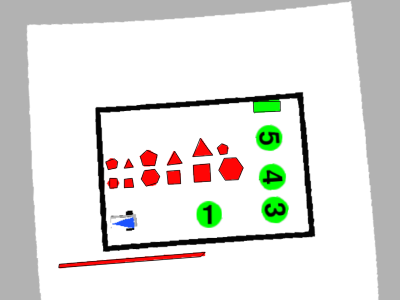
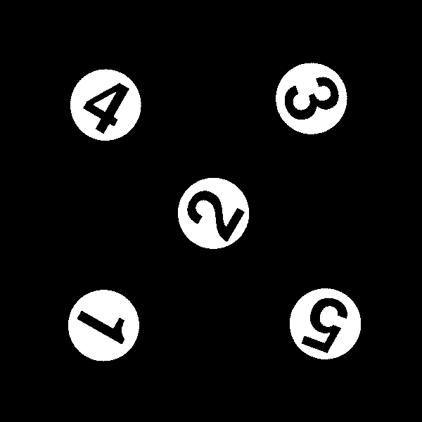

# Summary of implemented functions 

---

## Authors: Luca Caronti, Riccardo Scilla

---

   
<p!>

---

 Main Functions                        | Descriptions                                
--------------------------------|---------------------------------------------
`void `[`loadImage`](#namespacestudent_1a3117c968a47bf95f86bdb813a3b64e56)`(cv::Mat & img_out,const std::string & config_folder)`            | This function can be used to replace the simulator camera and test the developed pipeline on a set of custom image.
`void `[`genericImageListener`](#namespacestudent_1a3b726e7af03a643c06dcde23057a82ea)`(const cv::Mat & img_in,std::string topic,const std::string & config_folder)`            | Generic listener used from the image listener node.
`bool `[`extrinsicCalib`](#namespacestudent_1a6103f938ce28f8820c48c089d5f95098)`(const cv::Mat & img_in,std::vector< cv::Point3f > object_points,const cv::Mat & camera_matrix,cv::Mat & rvec,cv::Mat & tvec,const std::string & config_folder)`            | Finds arena pose from 3D(object_points)-2D(image_in) point correspondences.
`void `[`imageUndistort`](#namespacestudent_1aceb2a29362b8223a9d3601d9496e1c98)`(const cv::Mat & img_in,cv::Mat & img_out,const cv::Mat & cam_matrix,const cv::Mat & dist_coeffs,const std::string & config_folder)`            | Transforms an image to compensate for lens distortion. 
`void `[`findPlaneTransform`](#namespacestudent_1a528d33658d0d4d982a46f18b7abb4a70)`(const cv::Mat & cam_matrix,const cv::Mat & rvec,const cv::Mat & tvec,const std::vector< cv::Point3f > & object_points_plane,const std::vector< cv::Point2f > & dest_image_points_plane,cv::Mat & plane_transf,const std::string & config_folder)`            | Calculates a perspective transform from four pairs of the corresponding points. 
`void `[`unwarp`](#namespacestudent_1a6b8caf348979f55e58a75193233c219d)`(const cv::Mat & img_in,cv::Mat & img_out,const cv::Mat & transf,const std::string & config_folder)`            | Applies a perspective transformation to an image. 
`bool `[`processMap`](#namespacestudent_1a153a17ef667d7c10b8f33d815b9bc1bc)`(const cv::Mat & img_in,const double scale,std::vector< Polygon > & obstacle_list,std::vector< std::pair< int, Polygon >> & victim_list,Polygon & gate,const std::string & config_folder)`            | Process the image to detect victims, obtacles and the gate 
`bool `[`findRobot`](#namespacestudent_1afd56b779672a672e15ac45dc927b8a6b)`(const cv::Mat & img_in,const double scale,Polygon & triangle,double & x,double & y,double & theta,const std::string & config_folder)`            | Process the image to detect the robot pose
` bool planPath(const Polygon& borders, const std::vector<Polygon>& obstacle_list,  const std::vector<std::pair<int,Polygon>>& victim_list,  const Polygon& gate, const float x, const float y, const float theta,  Path& path, const std::string& config_folder)` | Plan the path according to chosen mission.

Support functions | Descriptions                                
--------------------------------|---------------------------------------------
`bool `[`readCSV`](#extrinsicCalib_readCSV)`(std::fstream &file, std::vector<std::string> &string_vector, int &elements_for_line)`            |  This function raed a CSV file and returns a string vector with all elements and a variable 
`void `[`writePointsCSV`](#extrinsicCalib_writePointsCSV)`(std::fstream &file, std::vector<cv::Point2f> points)`            |  Writes points into CSV file 
`void `[`CallBackFunc`](#extrinsicCalib_CallBackFunc)`(int event, int x, int y, int flags, void *userdata)`            |  Call back funtion when mouse key is pressed on the image 
`void `[`selectNpoints`](#extrinsicCalib_selectNpoints)`(const cv::Mat &image, std::vector<cv::Point2f> &allPoints, int num_points_to_take)`            |  This function allow to select with mouse pointer N points inside the image
`void `[`detectSingleDigit`]()`(cv::Rect Rect, cv::Mat img, cv::Mat greenObjs, std::vector<std::pair<cv::Mat, int>> templates)` | Match templates to recognize digit inside the green circles of the image
`void `[`detectDigits`]()`(cv::Mat image, cv::Mat greenObjs)` | Find the countours of single green object to be detected as digit
`void printPolygonsShapeStat(const std::vector<std::vector<cv::Point> >& _Polygons, const std::string& _name)` | Print the statistics of the polygons shapes
`double findDistance(const Point& P1, const Point& P2)` | Find the distance between two points
`Point findVertex(const Point& P1, const Point& P2, const Point& P3)` | Find the vertex of a tringle (if it's equilater return P3)

## Main functions

---

#### `void `[`loadImage`](#namespacestudent_1a3117c968a47bf95f86bdb813a3b64e56)`(cv::Mat & img_out,const std::string & config_folder)` 

This function can be used to replace the simulator camera and test the developed pipeline on a set of custom image.

##### Parameters
* `image_out [out]` The loaded raw image 

* `config_folder [in]` A custom string from config file.

---

#### `void `[`genericImageListener`](#namespacestudent_1a3b726e7af03a643c06dcde23057a82ea)`(const cv::Mat & img_in,std::string topic,const std::string & config_folder)` 

Generic listener used from the image listener node.

##### Parameters
* `image_in [in]` Input image to store 

* `topic [in]` Topic from where the image is taken 

* `config_folder [in]` A custom string from config file.

---

#### `bool `[`extrinsicCalib`](#namespacestudent_1a6103f938ce28f8820c48c089d5f95098)`(const cv::Mat & img_in,std::vector< cv::Point3f > object_points,const cv::Mat & camera_matrix,cv::Mat & rvec,cv::Mat & tvec,const std::string & config_folder)` 

Finds arena pose from 3D(object_points)-2D(image_in) point correspondences.

##### Parameters
* `image_in [in]` Input image to store 

* `object_points [in]` 3D position of the 4 corners of the arena, following a counterclockwise order starting from the one near the red line. 

* `camera_matrix [in]` 3x3 floating-point camera matrix 

* `rvec [out]` Rotation vectors estimated linking the camera and the arena 

* `tvec [out]` Translation vectors estimated for the arena 

* `config_folder [in]` A custom string from config file. 

##### Returns
`[bool]` false if there are some errors, true otherwise

##### Operations done

1. Check if file `[config_folder]/extrinsicCalibData.csv` exists.
   1. If file exists so it's read with funtion `readCSV`
   2. If file doesn't exist:
      1. `selectNpoints` function is called. (You must press your left key of mouse and select the 4 corners in counterclockwise, starting from the lower left corner)
      
      2. Once N points are been selected, they are saved into CSV file thanks to function `writePointsCSV`
2. `cv::solvePnp` funtion is called.

---

#### `void `[`imageUndistort`](#namespacestudent_1aceb2a29362b8223a9d3601d9496e1c98)`(const cv::Mat & img_in,cv::Mat & img_out,const cv::Mat & cam_matrix,const cv::Mat & dist_coeffs,const std::string & config_folder)` 

Transforms an image to compensate for lens distortion. 
##### Parameters
* `image_in [in]` distorted image 

* `image_out [out]` undistorted image 

* `camera_matrix [in]` 3x3 floating-point camera matrix 

* `dist_coeffs [out]` distortion coefficients [k1,k2,p1,p2,k3] 

* `config_folder [in]` A custom string from config file.

##### Results
1. Distorted image

2. Undistorted image

---

#### `void `[`findPlaneTransform`](#namespacestudent_1a528d33658d0d4d982a46f18b7abb4a70)`(const cv::Mat & cam_matrix,const cv::Mat & rvec,const cv::Mat & tvec,const std::vector< cv::Point3f > & object_points_plane,const std::vector< cv::Point2f > & dest_image_points_plane,cv::Mat & plane_transf,const std::string & config_folder)` 

Calculates a perspective transform from four pairs of the corresponding points. 
##### Parameters
* `camera_matrix [in]` 3x3 floating-point camera matrix 

* `rvec [in]` Rotation vectors estimated linking the camera and the arena 

* `tvec [in]` Translation vectors estimated for the arena 

* `object_points_plane [in]` 3D position of the 4 corners of the arena, following a counterclockwise order starting from the one near the red line. 

* `dest_image_points_plane [in]` destinatino point in px of the object_points_plane 

* `plane_transf [out]` plane perspective trasform (3x3 matrix) 

* `config_folder [in]` A custom string from config file.

---

#### `void `[`unwarp`](#namespacestudent_1a6b8caf348979f55e58a75193233c219d)`(const cv::Mat & img_in,cv::Mat & img_out,const cv::Mat & transf,const std::string & config_folder)` 

Applies a perspective transformation to an image. 
##### Parameters
* `image_in [in]` input image 

* `image_out [out]` unwarped image 

* `transf [in]` plane perspective trasform (3x3 matrix) 

* `config_folder [in]` A custom string from config file.

---

#### `bool `[`processMap`](#namespacestudent_1a153a17ef667d7c10b8f33d815b9bc1bc)`(const cv::Mat & img_in,const double scale,std::vector< Polygon > & obstacle_list,std::vector< std::pair< int, Polygon >> & victim_list,Polygon & gate,const std::string & config_folder)` 

Process the image to detect victims, obtacles and the gate 
##### Parameters
* `image_in [in]` input image 

* `scale [in]` 1px/scale = X meters 

* `obstacle_list [out]` list of obstacle polygon (vertex in meters) 

* `victim_list [out]` list of pair victim_id and polygon (vertex in meters) 

* `gate [out]` polygon representing the gate (vertex in meters) 

* `config_folder [in]` A custom string from config file.

##### Return
* `bool` True if one gate is found, otherwise return false (NOTE: no check on victim and obstacle number is done)

##### Operations done
NOTE: if `#define BLUE_GATE` is uncommented so the gate is supposed to be blue, otherwise it's supposed to be green (In the follow description is supposed to be green).

Start image:

1. Colors range are defined (in HSV color space) as follow:
   * Green ranges
      * `cv::Scalar greenHSV_L(52,40,40);`
      * `cv::Scalar greenHSV_H(72,255,255);`
   * Blue ranges
      * `cv::Scalar blueHSV_L(105,40,40);`
      * `cv::Scalar blueHSV_H(125,255,255);`
   * Red ranges (Note that there are two range for red color, this because in HSV red color is around Hue = $0^\circ$. So in order to take a range of $20^\circ$ there are two ranges, one between $[170^\circ,180^\circ]$ and one between $[0^\circ, 10^\circ]$)
      * `cv::Scalar redHSV_L_1(170,40,40);`
      * `cv::Scalar redHSV_H_1(180,255,255);`
      * `cv::Scalar redHSV_L_2(0,40,40);`
      * `cv::Scalar redHSV_H_2(10,255,255);`

2. Apply a mask to the image (Green and Red* in this case)
   

      
      
   <p!>

   \* For red image, two mask are applied (as described in the previous point) and the a OR is applied to results (with funtion `bitwise_or`) 

3. Detect digit procedure is done:
   1. `findContours` function is called to find green contours

   2. `approxPolyDP` function is used to approximate contours

   3. Each contour, is has more than 7 sides, is passed to `detectSingleDigit` function. Then the function return the number of detected digit (or -1 if there is an error) and `victim_list` is updated (scaling the polygon points).

4. A kernel is defined as follow:
   `cv::Mat element = cv::getStructuringElemen (cv::MORPH_RECT, cv::Size(3,3));`

5. An erosion is performed:
   

      
      
   <p!>

6. A dilation is performed
   

      
      
   <p!>

7. Countours are found from the new image
8. An approximatin is performed to contours
9. Is checked if there are one gate (so in practice is checked if there is one green (or blue is `#define BLUE_GATE` is uncommented) object with 4 sides. If there isn't or there are more than one then funtion return false).
10. `obstacle_list` and `gate` variables are updated.

Final results (of obstacles and gate detection):

---

#### `bool `[`findRobot`](#namespacestudent_1afd56b779672a672e15ac45dc927b8a6b)`(const cv::Mat & img_in,const double scale,Polygon & triangle,double & x,double & y,double & theta,const std::string & config_folder)` 

Process the image to detect the robot pose 
##### Parameters
* `image_in [in]` input image 

* `scale [in]` 1px/scale = X meters 

* `x [out]` x position of the robot in the arena reference system 

* `y [out]` y position of the robot in the arena reference system 

* `theta [out]` yaw of the robot in the arena reference system 

* `config_folder [in]` A custom string from config file.

##### Returns
* `bool` true if the robot is found, false otherwise.

##### Operations done
Start image:

1. Image is converted from BGR to HSV color space

2. Blue mask is applied

3. `findContours` function is called to find blue object contours
4. `approxPolyDB` function is called to approximate contours
5. If there is only one object with 3 sides (triangle) so funtion can continue, othrewise the function return `false`. One future implementation can be that also if there are more than one blue object, the biggest one will be selected (if it's a triangle).
6. Triangle coordinates are scaled and saved
7. The center of triangle is found
8. `findVertex` funtion is called in order to find the vertex of triangle
9. Theta is calculated

---

#### `bool planPath(const Polygon& borders, const std::vector<Polygon>& obstacle_list,  const std::vector<std::pair<int,Polygon>>& victim_list,  const Polygon& gate, const float x, const float y, const float theta,  Path& path, const std::string& config_folder);`

Plan the path according to chosen mission.
##### Parameters

* `borders [in]`        border of the arena [m]
* `obstacle_list [in]`  list of obstacle polygon [m]
* `victim_list [in]`    list of pair victim_id and polygon [m]
* `gate [in]`           polygon representing the gate [m]
* `x [in]`              x position of the robot in the arena reference system
* `y [in]`              y position of the robot in the arena reference system
* `theta [in]`          yaw of the robot in the arena reference system
* `path [out]`          output path of planned path
* `config_folder [in]`  A custom string from config file.
##### Returns
* `bool` true if path is computed correctly, false otherwise

##### Description
To chose the mission to implment, uncomment one of the following `#define` and recompile the project:
* `#define MISSION_1`
* `#define MISSION_2`
* `#define MISSION_2_fast`

__MISSION 1:__ Victim are chosen in cresent order wrt their number. All victims are chosen.
__MISSION 2:__ 
* Consists on a brute force search, for each victims combination a path length is found
* For each number of victims a best result is taken (i.e. one path that picks one victim, one for 2 victims, one for 3 victim etc.)
* Starting with one victim with length $L$, if the path picking up one more victim length is $\le L + (10\% \cdot L)$ this path is taken. The procedure is repeated, but at each iteration the margin in divided by two $(10\% \to 5\% \to 2.5\% \to \text{etc})$

__MISSION 2 FAST:__

To see how the path is computed see [this document](doc/sbmp.md)
---

## Support functions

---
#### `bool `[`readCSV`](#extrinsicCalib_readCSV)`(std::fstream &file, std::vector<std::string> &string_vector, int &elements_for_line)`

This function raed a CSV file and returns a string vector with all elements and a variable that indicates how many elements there are for each line.
##### Parameters

* `file [in]`                festream file to read
* `string_vector [out]`       vector with all elements read
* `elements_for_line [out]`   number of elements for line
##### Returns
* `(bool)` True if there aren't errors, false otherwise

---

#### `void `[`writePointsCSV`](#extrinsicCalib_writePointsCSV)`(std::fstream &file, std::vector<cv::Point2f> points)`

Writes points into CSV file
##### Prameters

* `file [out]` file in which save the points
* `points [in]` vector of points

---

#### `void `[`CallBackFunc`](#extrinsicCalib_CallBackFunc)`(int event, int x, int y, int flags, void *userdata)`

Call back funtion when mouse key is pressed on the image
##### Parameters

* `event [in]` type of event
* `x [in]` x coordinate of pressed point
* `y [in]` y coordinate of pressed point
* `userdata [in/out]` user data (mouseCallbackUserData_t)

---

#### `void `[`selectNpoints`](#extrinsicCalib_selectNpoints)`(const cv::Mat &image, std::vector<cv::Point2f> &allPoints, int num_points_to_take)`
This function allows to select with mouse pointer N pints inside the image

##### Parameters
* `image [in]` image in which select points
* `allPoints [out]` vector of points 2D selected
* `num_points_to_take [in]` number of points to slect

---

#### `void printPolygonsShapeStat(const std::vector<std::vector<cv::Point> >& _Polygons, const std::string& _name)`
Print the statistics of the polygons shapes

##### Parameters
* `_Polygons [in]` The vector with Polygons inside
* `_name [in]` The name of Polygons to print

---

#### `double findDistance(const Point& P1, const Point& P2)`
Find the distance between two points

##### Parameters
* `PI [in]` firt point
* `PI [in]` Second point

##### Return
* `double` the distance between points

---

#### `Point findVertex(const Point& P1, const Point& P2, const Point& P3)`
Find the vertex of a tringle (if it's equilater return P3)

##### Parameters
* `PI [in]` first point
* `P2 [in]` second point
* `P3 [in]` third point

##### Return
* `Point` the vertex point

---

#### `void `[`detectDigits`]()`(cv::Mat image, cv::Mat greenObjs)`

Find the countours of single green object to be detected as digit

##### Parameters
* `image` original image
* `greenObjs [in]` green objects extracted from the hsv original image

##### Operations done
1. augment the templates using `augmentTemplates` function
2. `findContours` function is called to find green object contours
3. `approxPolyDB` function is called for every contour found, to approximate contours
4. `detectSingleDigit` is called to match the contour with the templates

---

#### `void `[`detectSingleDigit`]()`(cv::Rect Rect, cv::Mat img, cv::Mat greenObjs, std::vector<std::pair<cv::Mat, int>> templates)`

Match templates to recognize digit inside the green circles of the image

##### Parameters
* `Rect` bounding box for a green blob
* `img` original image
* `greenObjs` green objects extracted from the hsv original image
* `templates` vector of associated Template-Number

##### Operations done
1. filter the green mask

2. `findContours` function is called
3. `bitwise_not` is called to generate binary mask with inverted pixels

4. `processROI` is called to extract the ROI containing the digit

5. scan all the templates and compare them with the ROI. A score is assigned and the higher one is saved.

---

Generated by [Moxygen](https://sourcey.com/moxygen)
