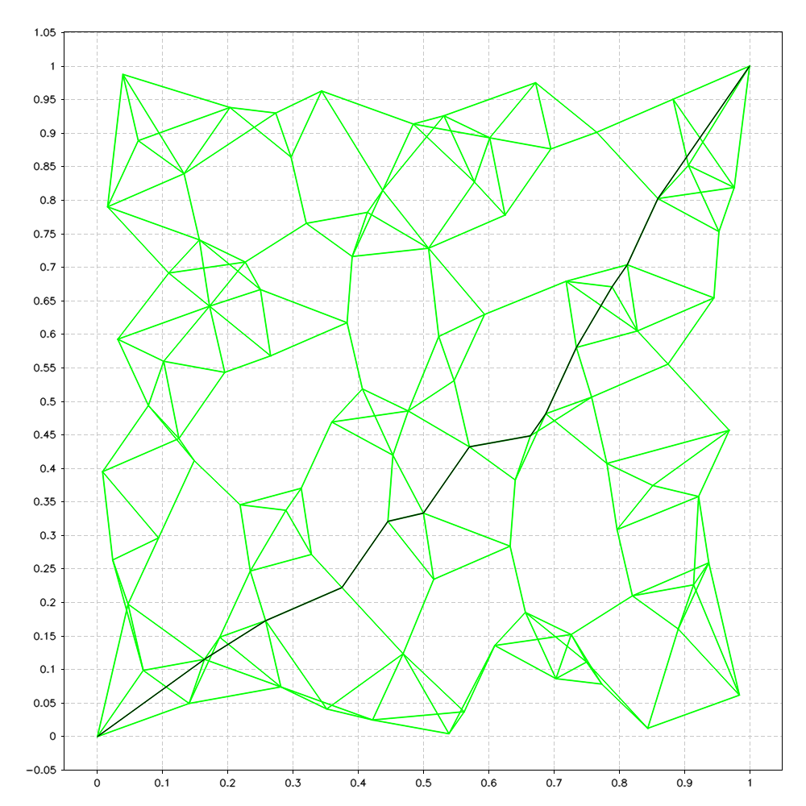

# Dijkstra

This class is used to find the shortest path of a graph using Dijkstra algorithm.

__NOTE:__ In order to use this class, `operator<` for `cv::Point2d` should be defined 

```c++
// distNode_t is a pair representing the weight (double) of a connection with point (cv::Point2d)
typedef std::pair<double, cv::Point2d> distNode_t;

class Dijkstra{
    public:
        /* Attributes */
        // Map with all points, and for each point a list of connection with a weight
        std::map<cv::Point2d, std::list<distNode_t> > nodes;
        /* Methods */
        Dijkstra();
        ~Dijkstra();
        bool addEdge(const cv::Point2d start, const cv::Point2d end,const double weight);
        bool shortesPath(const cv::Point2d start, const cv::Point2d end, std::vector<cv::Point2d>& best_path) const;
        void print() const;
};
```

---


#### `bool Dijkstra::addEdge(const cv::Point2d start, const cv::Point2d end, const double weight);`

Add a edge in the graph

##### Parameters
* `const cv::Point2d start [in]`  start point of the edge
* `const cv::Point2d end  [in]`   end point of the edge
* `const cv::Point2d double [in]` the weight of the edge

##### Return 
* `bool` false if the edge already exists, true otherwise

##### Description
* Add a edge in the graph, i.e. add a connection from `start` to `end` in `nodes` class attribute, and also viceversa (from `end` to `start`).
* If the connection already exists, return `false`. 
* A `map` of nodes is used to seed up the search (i.e. O(log(n))).
* Example of graph using random points and `N_neighbours=4` (See `sbmp`), respectively 100, 1000, 10000 and 100000 points
<p float="left">
      
      
      
      
<p!>

* Example of graph using Halton points and `N_neighbours=4` (See `sbmp`), respectively 100, 1000, 10000 and 100000 points
<p float="left">
      
      
      
      
<p!>

---

#### `bool Dijkstra::shortesPath(const cv::Point2d start, const cv::Point2d end, std::vector<cv::Point2d>& best_path) const;`

Finds the shortest path with Dijkstra algorithm

##### Parameters 
* `const cv::Point2d start [in]`                    start point
* `const cv::Point2d end  [in]`                     end point
* `std::vector<cv::Point2d>& best_path  [in/out]`   resulting best path

##### Return 
* `bool` false if no path is found, true otherwise

##### Description
* To parameter `best_path` is appended the best path from start to end. If last point of old `best_path` is equal to `start` point of the current path it will be erased.
* The operation done are:
    - All nodes dinstance is initialized as infinity from `start`.
    - All nodes best parent (i.e. a pointer that points to the parent that has the shortest way to reach `start`) is initilized as themself (i.e. there are no best parent yet)
    - Using a priority queue to speed up the code, find the shortest path from start to end. Each node will have a total weight from start to it, and each time the not analyzed node with lower weight is analyzed.
    - At the end a fastest way is recostructed starting from `end` and passing through best parents.

* Example of best_path using Dijkstra, random points and `N_neighbours=4` (See `sbmp`), respectively 100, 1000 and 10000 points
<p float="left">
      
      
      
<p!>

* Example of best path using Dijkstra, Halton points and `N_neighbours=4` (See `sbmp`), respectively 100, 1000 and 10000 points
<p float="left">
      
      
      
<p!>