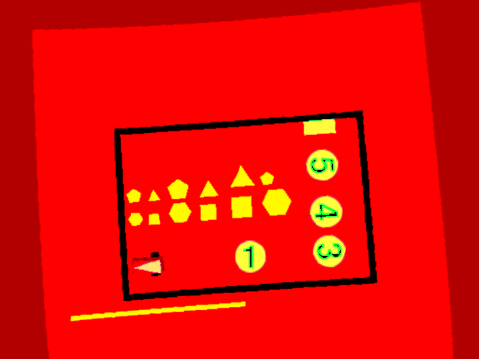

# Find Robot

| Functions | Descriptions
|-|-|
`bool findRobot (const cv::Mat & img_in,const double scale,Polygon & triangle,double & x,double & y,double & theta,const std::string & config_folder)` | Process the image to detect the robot pose
`double findDistance(const Point& P1, const Point& P2)` | Find the distance between two points
`Point findVertex(const Point& P1, const Point& P2, const Point& P3)` | Find the vertex of a tringle (if it's equilater return P3)

---

#### `bool findRobot (const cv::Mat & img_in,const double scale,Polygon & triangle,double & x,double & y,double & theta,const std::string & config_folder)` 

Process the image to detect the robot pose 
##### Parameters
* `image_in [in]` input image 

* `scale [in]` 1px/scale = X meters 

* `x [out]` x position of the robot in the arena reference system 

* `y [out]` y position of the robot in the arena reference system 

* `theta [out]` yaw of the robot in the arena reference system 

* `config_folder [in]` A custom string from config file.

##### Returns
* `bool` true if the robot is found, false otherwise.

##### Operations done
Start image:

1. Image is converted from BGR to HSV color space

2. Blue mask is applied

3. `findContours` function is called to find blue object contours
4. `approxPolyDB` function is called to approximate contours
5. If there is only one object with 3 sides (triangle) so funtion can continue, othrewise the function return `false`. One future implementation can be that also if there are more than one blue object, the biggest one will be selected (if it's a triangle).
6. Triangle coordinates are scaled and saved
7. The center of triangle is found
8. `findVertex` funtion is called in order to find the vertex of triangle
9. Theta is calculated

---

#### `double findDistance(const Point& P1, const Point& P2)`
Find the distance between two points

##### Parameters
* `PI [in]` firt point
* `PI [in]` Second point

##### Return
* `double` the distance between points

---

#### `Point findVertex(const Point& P1, const Point& P2, const Point& P3)`
Find the vertex of a tringle (if it's equilater return P3)

##### Parameters
* `PI [in]` first point
* `P2 [in]` second point
* `P3 [in]` third point

##### Return
* `Point` the vertex point
