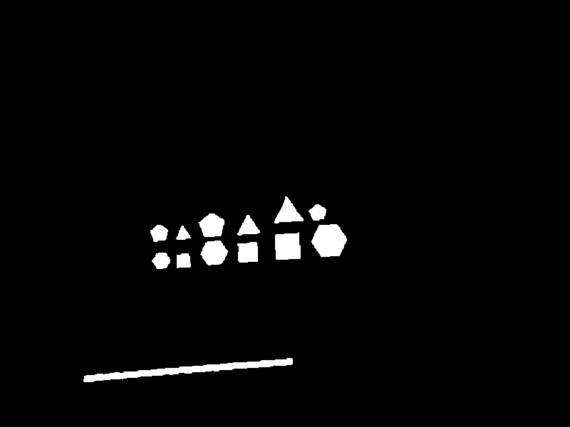

# Process Map

| Functions | Descriptions
|-|-|
`bool processMap (const cv::Mat & img_in,const double scale,std::vector< Polygon > & obstacle_list,std::vector< std::pair< int, Polygon >> & victim_list,Polygon & gate,const std::string & config_folder)`  | Process the image to detect victims, obtacles and the gate 
`void detectSingleDigit(cv::Rect Rect, cv::Mat img, cv::Mat greenObjs, std::vector<std::pair<cv::Mat, int>> templates)` | Match templates to recognize digit inside the green circles of the image
`void detectDigits(cv::Mat image, cv::Mat greenObjs)` | Find the countours of single green object to be detected as digit
`void printPolygonsShapeStat(const std::vector<std::vector<cv::Point> >& _Polygons, const std::string& _name)` | Print the statistics of the polygons shapes

---

#### `bool processMap (const cv::Mat & img_in,const double scale,std::vector< Polygon > & obstacle_list,std::vector< std::pair< int, Polygon >> & victim_list,Polygon & gate,const std::string & config_folder)` 

Process the image to detect victims, obtacles and the gate 
##### Parameters
* `image_in [in]` input image 

* `scale [in]` 1px/scale = X meters 

* `obstacle_list [out]` list of obstacle polygon (vertex in meters) 

* `victim_list [out]` list of pair victim_id and polygon (vertex in meters) 

* `gate [out]` polygon representing the gate (vertex in meters) 

* `config_folder [in]` A custom string from config file.

##### Return
* `bool` True if one gate is found, otherwise return false (NOTE: no check on victim and obstacle number is done)

##### Operations done
NOTE: if `#define BLUE_GATE` is uncommented so the gate is supposed to be blue, otherwise it's supposed to be green (In the follow description is supposed to be green).

Start image:

1. Colors range are defined (in HSV color space) as follow:
   * Green ranges
      * `cv::Scalar greenHSV_L(52,40,40);`
      * `cv::Scalar greenHSV_H(72,255,255);`
   * Blue ranges
      * `cv::Scalar blueHSV_L(105,40,40);`
      * `cv::Scalar blueHSV_H(125,255,255);`
   * Red ranges (Note that there are two range for red color, this because in HSV red color is around Hue = $0^\circ$. So in order to take a range of $20^\circ$ there are two ranges, one between $[170^\circ,180^\circ]$ and one between $[0^\circ, 10^\circ]$)
      * `cv::Scalar redHSV_L_1(170,40,40);`
      * `cv::Scalar redHSV_H_1(180,255,255);`
      * `cv::Scalar redHSV_L_2(0,40,40);`
      * `cv::Scalar redHSV_H_2(10,255,255);`

2. Apply a mask to the image (Green and Red* in this case)
   

      
      
   <p!>

   \* For red image, two mask are applied (as described in the previous point) and the a OR is applied to results (with funtion `bitwise_or`) 

3. Detect digit procedure is done:
   1. `findContours` function is called to find green contours

   2. `approxPolyDP` function is used to approximate contours

   3. Each contour, is has more than 7 sides, is passed to `detectSingleDigit` function. Then the function return the number of detected digit (or -1 if there is an error) and `victim_list` is updated (scaling the polygon points).

4. A kernel is defined as follow:
   `cv::Mat element = cv::getStructuringElemen (cv::MORPH_RECT, cv::Size(3,3));`

5. An erosion is performed:
   

      
      
   <p!>

6. A dilation is performed
   

      
      
   <p!>

7. Countours are found from the new image
8. An approximatin is performed to contours
9. Is checked if there are one gate (so in practice is checked if there is one green (or blue is `#define BLUE_GATE` is uncommented) object with 4 sides. If there isn't or there are more than one then funtion return false).
10. `obstacle_list` and `gate` variables are updated.

Final results (of obstacles and gate detection):

---

#### `void detectDigits (cv::Mat image, cv::Mat greenObjs)`

Find the countours of single green object to be detected as digit

##### Parameters
* `image` original image
* `greenObjs [in]` green objects extracted from the hsv original image

##### Operations done
1. augment the templates using `augmentTemplates` function
2. `findContours` function is called to find green object contours
3. `approxPolyDB` function is called for every contour found, to approximate contours
4. `detectSingleDigit` is called to match the contour with the templates

---

#### `void detectSingleDigit (cv::Rect Rect, cv::Mat img, cv::Mat greenObjs, std::vector<std::pair<cv::Mat, int>> templates)`

Match templates to recognize digit inside the green circles of the image

##### Parameters
* `Rect` bounding box for a green blob
* `img` original image
* `greenObjs` green objects extracted from the hsv original image
* `templates` vector of associated Template-Number

##### Operations done
1. filter the green mask

2. `findContours` function is called
3. `bitwise_not` is called to generate binary mask with inverted pixels

4. `processROI` is called to extract the ROI containing the digit

5. scan all the templates and compare them with the ROI. A score is assigned and the higher one is saved.

---

#### `void printPolygonsShapeStat(const std::vector<std::vector<cv::Point> >& _Polygons, const std::string& _name)`
Print the statistics of the polygons shapes

##### Parameters
* `_Polygons [in]` The vector with Polygons inside
* `_name [in]` The name of Polygons to print

---