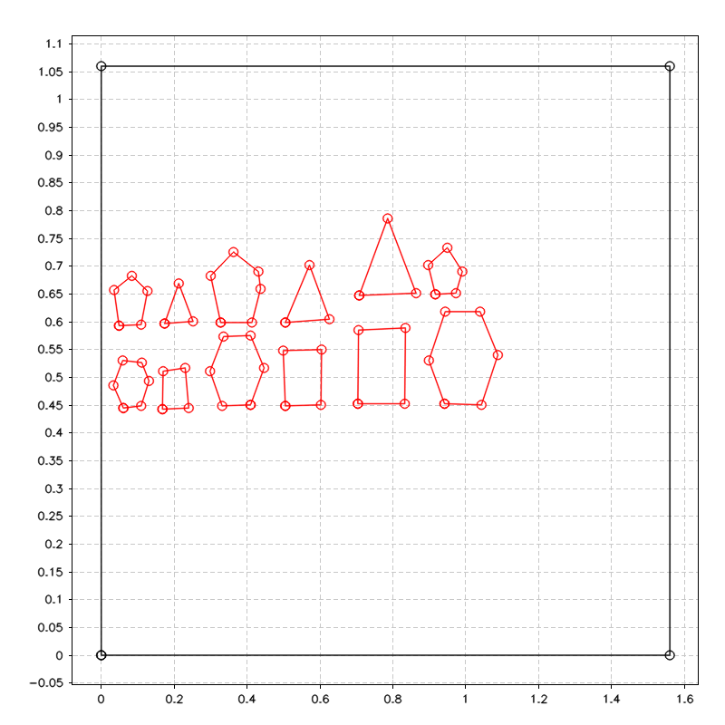
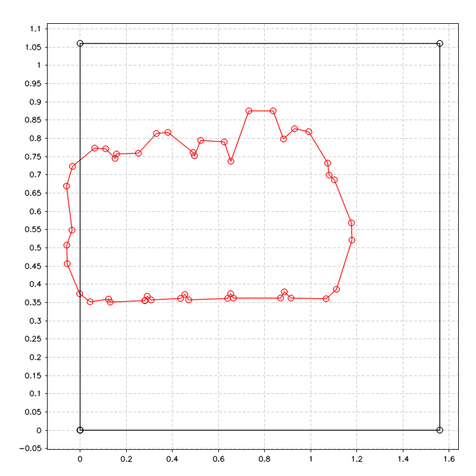
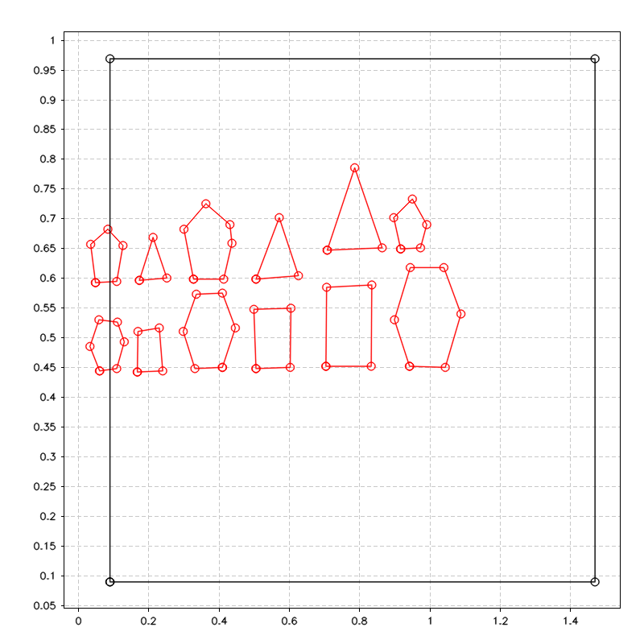

# Resize

Functions used to resize obstacles and arena to take into consideration the size of the robot.

__NOTE:__ Requires clipper library to work 

---

#### std::vector<Polygon> resizeObstacles(const std::vector<Polygon> &obstacles, double robotSize)

Enlarge the obstacles by the size of the robot and merge them if they overlap

##### Parameters
* `const std::vector<Polygon> &obstacles [in]` original vector of obstacles
* `double robotSize [in]` size of the robot

##### Return
* `std::vector<Polygon>` vector of resized obstacles

##### Description
* For every `obstacle`:
    - transform it to Clipper object
    - apply the offset given by the `robotSize`
    - add it to a `ClipperLib::Paths`
* Merge all the obstacles in the path.
* Trasform the merged obstacles back to a vector of `Polygon`.
* Example of resized obstacles

      
      
<p!>

---

#### Polygon resizeBorders(const Polygon &borders, double robotSize)

Reduce the borders of the arena by the size of the robot

##### Parameters
* `const std::vector<Polygon> &borders [in]` original borders of the arena
* `double robotSize [in]` size of the robot

##### Return
* `Polygon` resized borders of the arena

##### Description
* Transform the `borders` to Clipper object.
* Apply the offset given by the `robotSize`.
* Trasform the resized borders back to `Polygon`.
* Change the order of the points for future application.
* Example of resized borders

      
      
<p!>

---