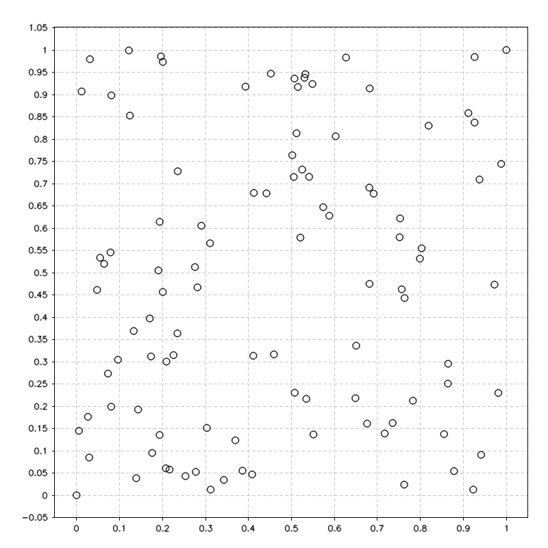
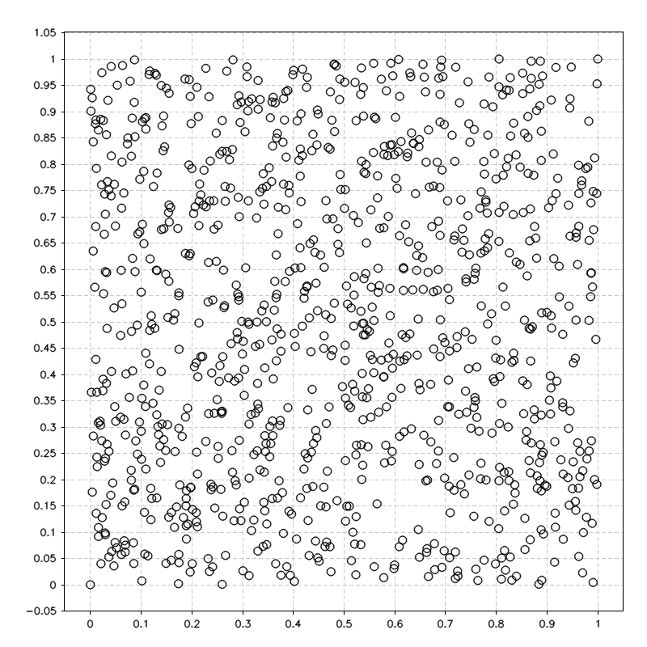
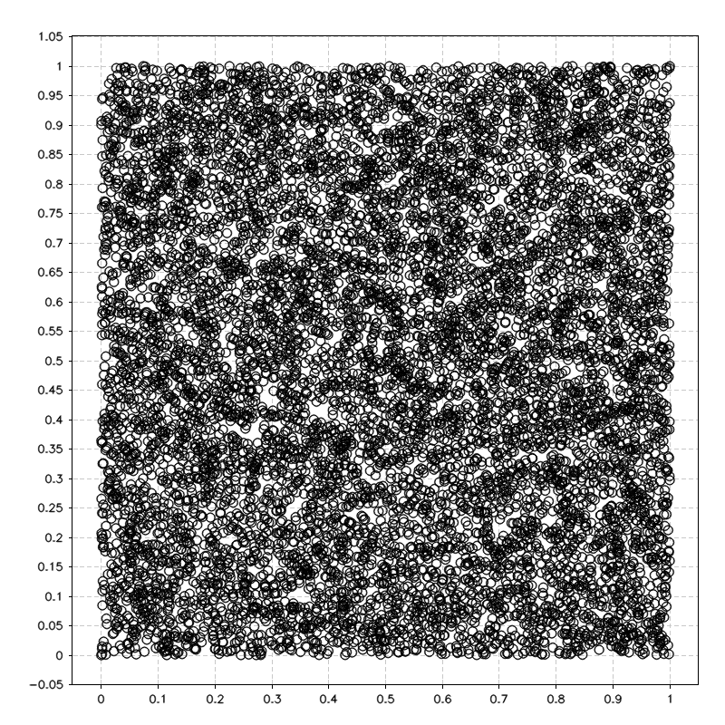
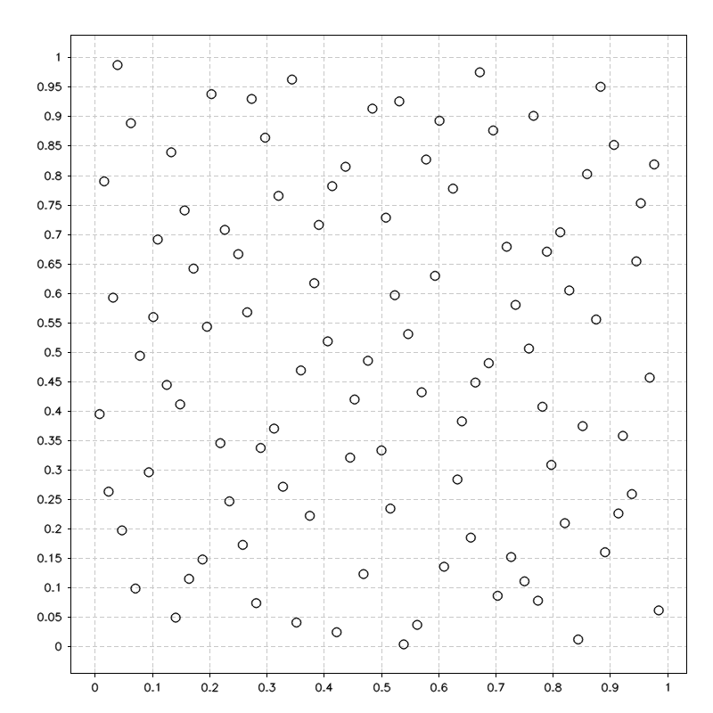
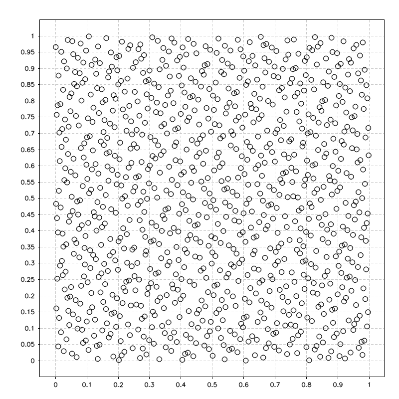
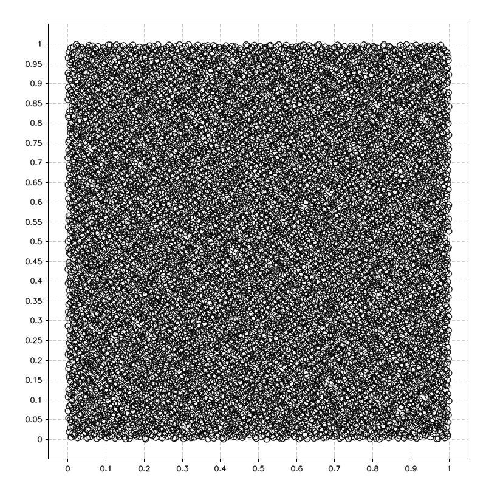

# Sampling

```c++
class Sampling{
    public:
        cv::Point2d generate_rnd_point(const int max_X, const int max_Y) const;
        std::vector<cv::Point2d> generate_N_rnd_points(const int N, const int max_X, const int max_Y) const;
        std::vector<cv::Point2d> generate_N_Halton_points(const int N, const int start = 0) const;
        std::vector<cv::Point2d> generate_N_Halton_points_multithread(const int N, const int N_jobs) const;
        Sampling();
        ~Sampling();
    };
```
This class is used to generate random, or Halton points in order to sample a map.

---
#### `cv::Point2d Sampling::generate_rnd_point(const int max_X, const int max_Y) const;`


Generate one random `cv::Point2d` point
##### Parameters 
* `const int max_X [in]`     max value for x
* `const int max_Y [in]`     max value for y
##### Return
* `cv::Point2d` the random cv::Point2d point

---
#### `std::vector<cv::Point2d> Sampling::generate_N_rnd_points(const int N, const int max_X, const int max_Y) const;`

Generate N random cv::Point2d points
##### Parameters 
* `const int N [in]`         Number of points
* `const int max_X [in]`     max value for x
* `const int max_Y [in]`     max value for y
##### Return
* `std::vector<cv::Point2d>` A vector with N random points
##### Description
The following image reprensents 2d sample maps with 100, 1000 and 10000 random points
<p float="left">
      
      
      
<p!>

---
#### `std::vector<cv::Point2d> Sampling::generate_N_Halton_points(const int N, const int start) const;`

Generate N Halton `cv::Point2d` points
##### Parameters
* `const int N [in]`        Number of points
* `const int start [in]`    Halton start value
##### Return
* `std::vector<cv::Point2d>` A vector with N Halton points
##### Description
Halton sequence is a deterministic, quasi-random sequence of number used to generate points. 
A pesudo-code that describes the generation:
```
algorithm Halton-Sequence is
    inputs: index i
            base b
    output: result r
    f ← 1
    r ← 0
    while i > 0 do
        f ← f/b
        r ← r + f ∗ (i % b)
        i ← ⌊i/b⌋
    return r
``` 
Our implementation of the algorithm is taken by:
_John Halton, On the efficiency of certain quasi-random sequences of points in evaluating multi-dimensional integrals, Numerische Mathematik, Volume 2, pages 84-90, 1960._

The following image reprensents 2d sample maps with 100, 1000 and 10000 Halton points
<p float="left">
      
      
      
<p!>

---

#### `std::vector<cv::Point2d> Sampling::generate_N_Halton_points_multithread(const int N, const int N_jobs = 1) const;`

Generate N Halton cv::Point2d points, using multiple threads

##### Parameters
* `const int N [in]`        Number of points
* `const int N_jobs = 1`    Number of threads

###### Return 
* `std::vector<cv::Point2d>` A vector with N Halton points

###### Descrption
Equal to `generate_N_Halton_points`, but now each thread `=N_jobs` generate an equal subset of points.