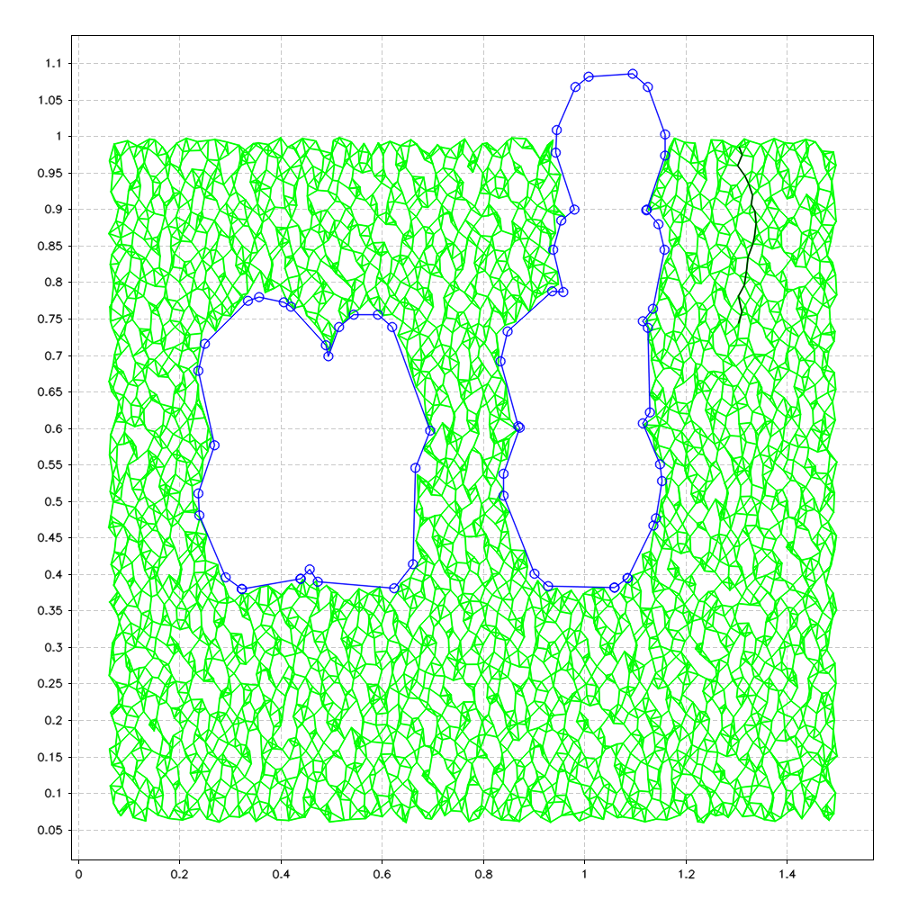
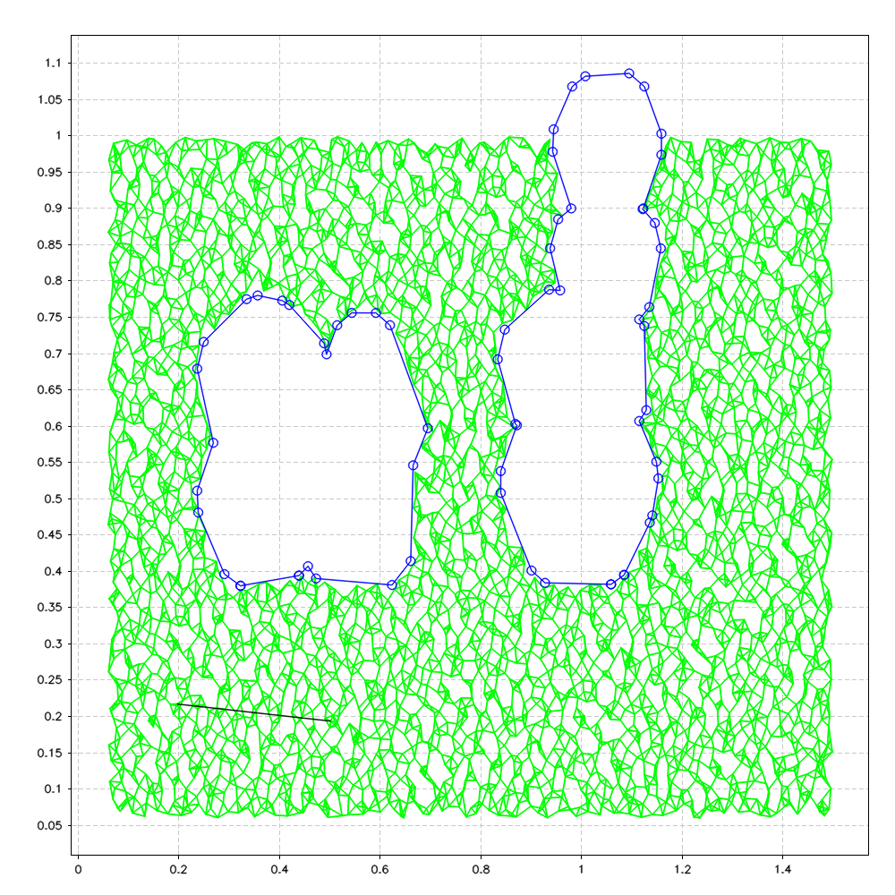
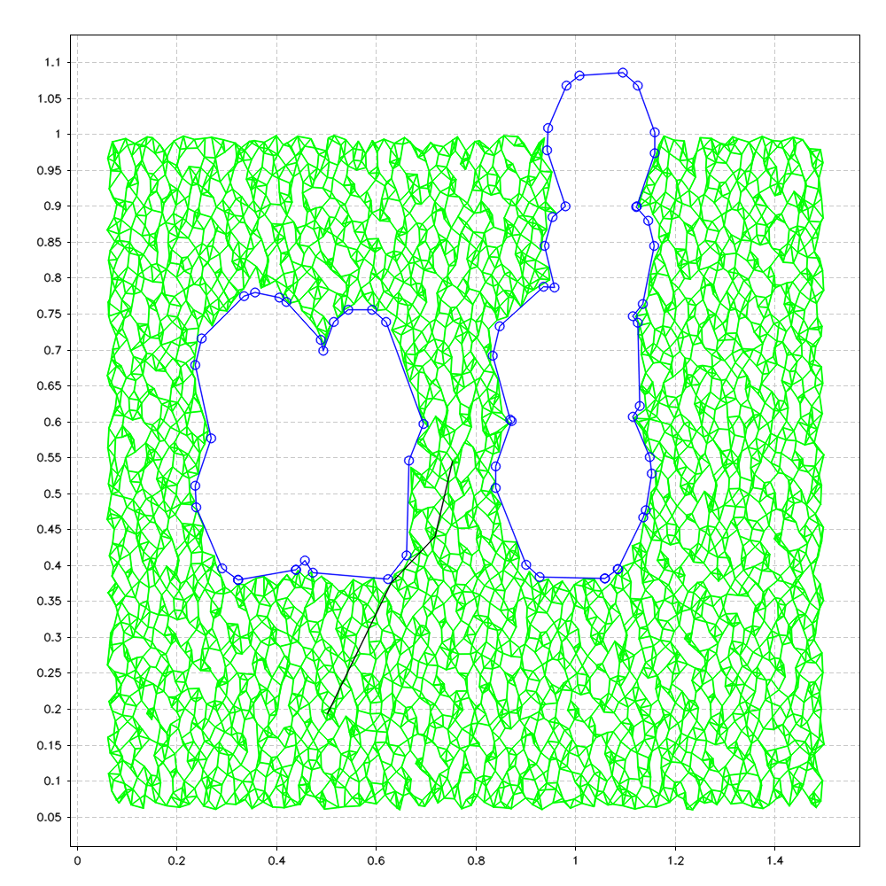
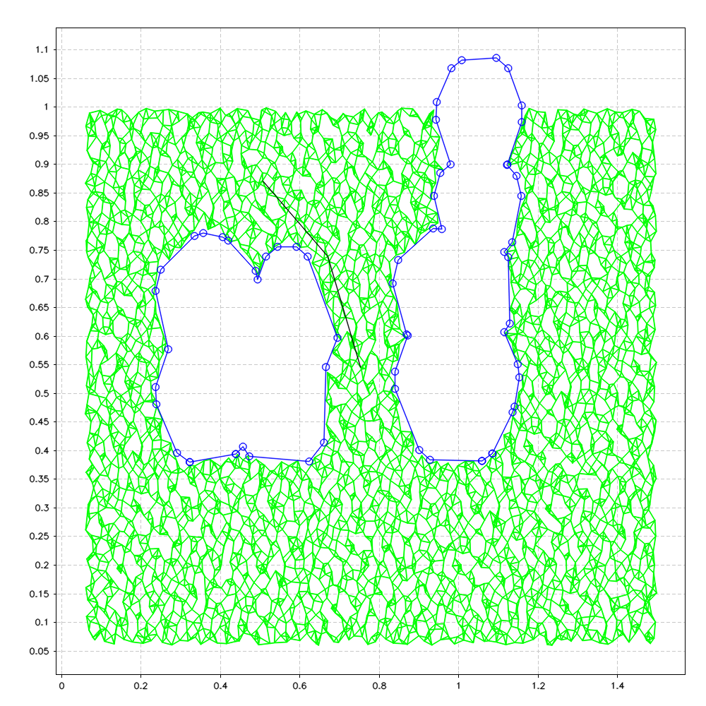
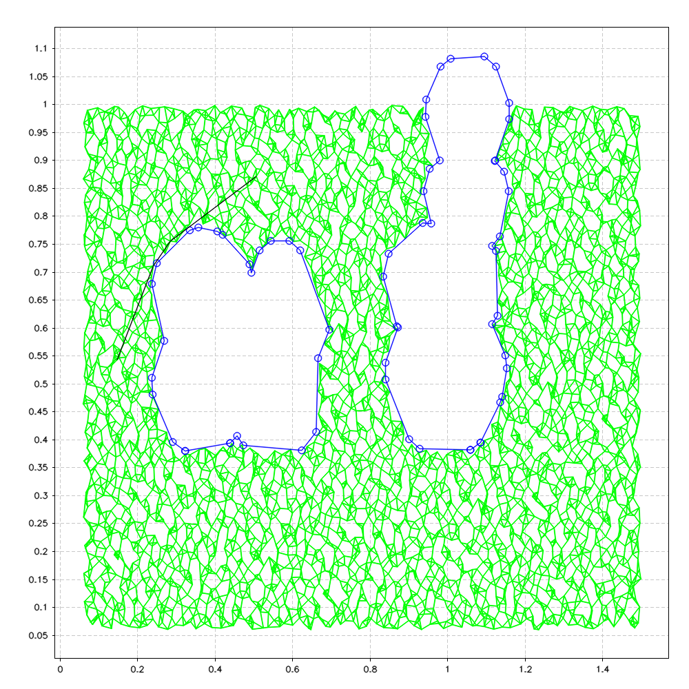
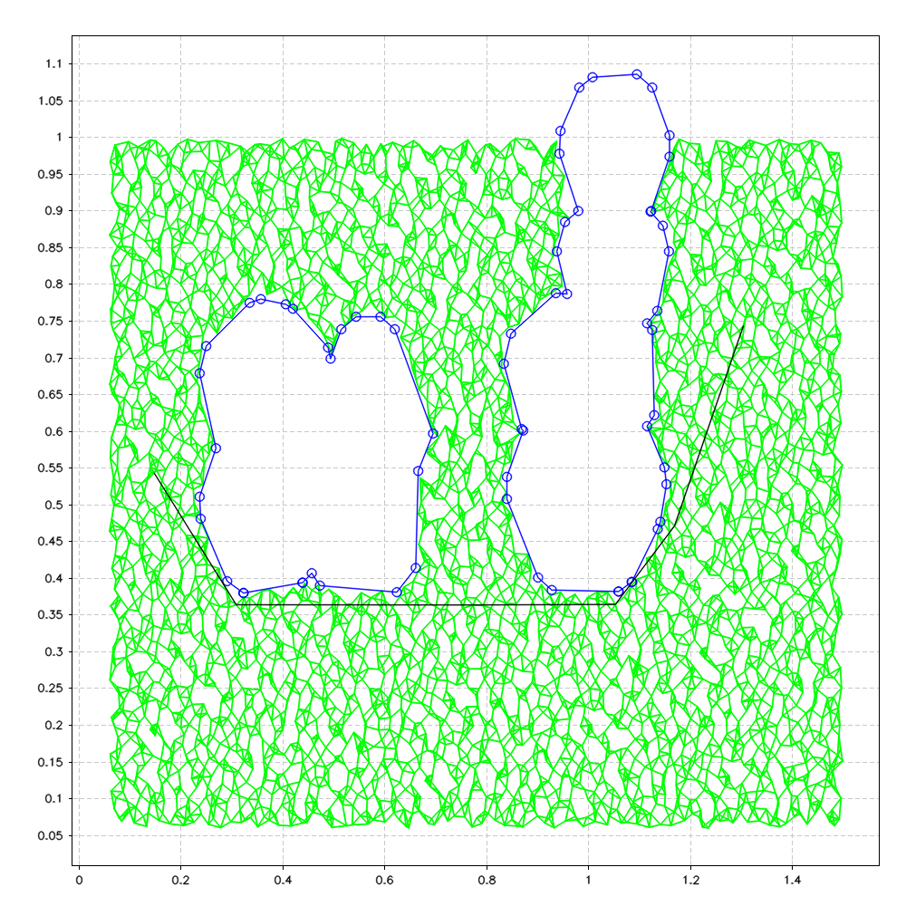
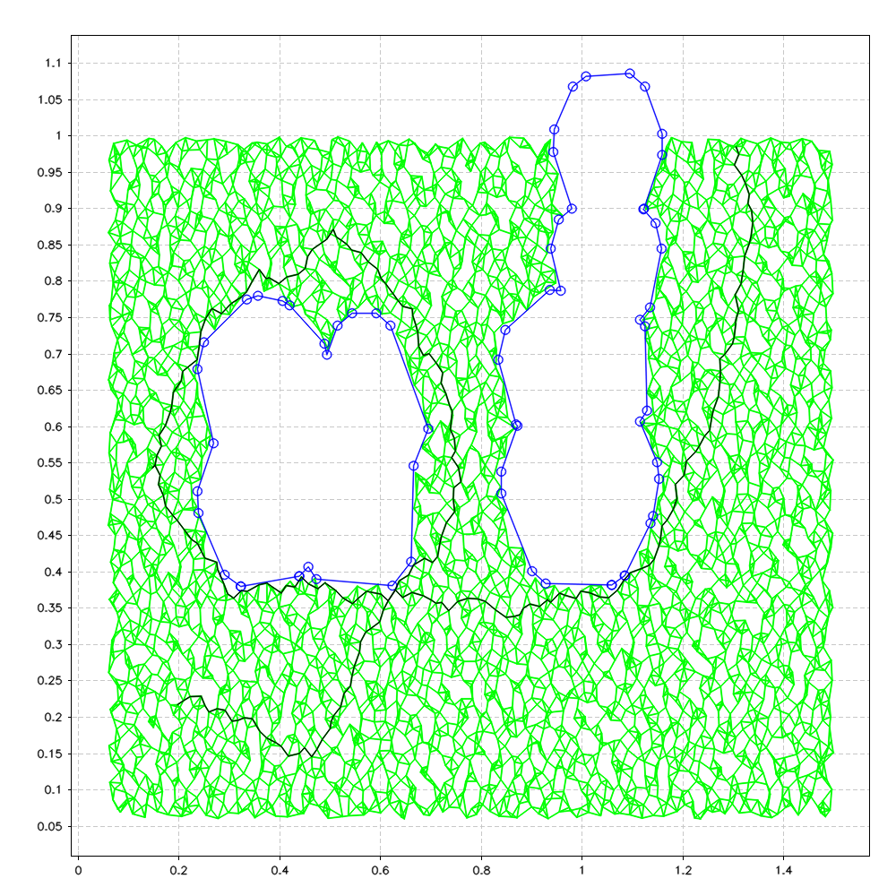
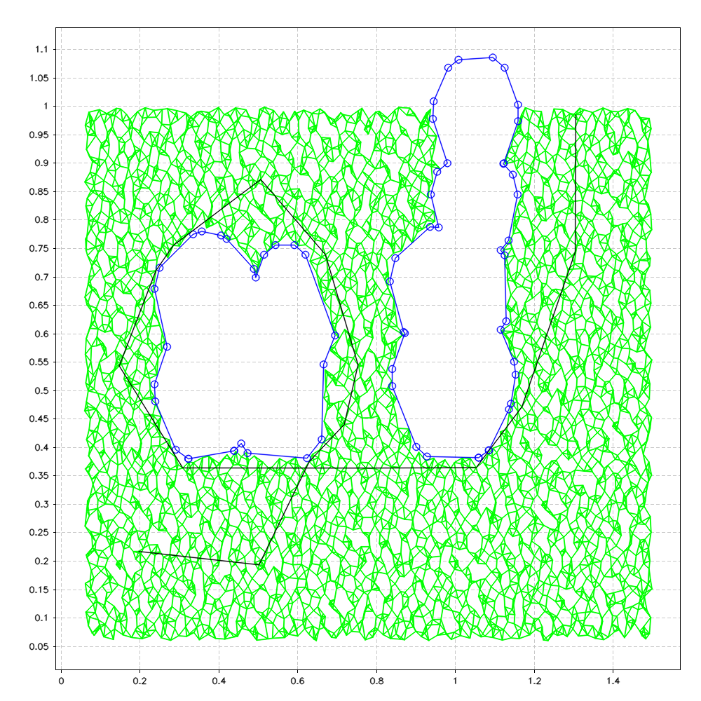

# Sampling Based Motion Planing (SBMP)


```c++
enum sample_type {halton_sampling, random_sampling};

class Sbmp{
private:
    /* Private methods */
    void find_discardable_points(const std::vector<cv::Point2d>& best_path, const unsigned int start_index, const unsigned int end_index, const std::vector<std::vector<cv::Point2d> >& obstacles, std::vector<cv::Point2d>& discarded_points)const;
public:
    /* Attributes */
    Sampling s;
    Dijkstra d;
    std::vector<cv::Point2d> sample_points;
    unsigned int N_jobs;
    /* Methods */
    Sbmp();
    ~Sbmp();
    void sample(const unsigned int N_points, const double size_x, const double size_y, const sample_type st=halton_sampling);
    void add_custom_point(cv::Point2d pt);
    void erase_sample_inside_obstacles(const std::vector<std::vector<cv::Point2d> >& obstacles);
    void create_graph(const unsigned int N_neighbours, const std::vector<std::vector<cv::Point2d> >& obstacles);
    bool find_shortest_path(const cv::Point2d start_point, const cv::Point2d end_point, std::vector<cv::Point2d>& best_path)const;
    void best_path_optimizer(std::vector<cv::Point2d>& best_path, const std::vector<std::vector<cv::Point2d> >& obstacles)const;
    bool find_shortest_path_and_optimized(const std::vector<cv::Point2d>& points,const std::vector<std::vector<cv::Point2d> >& obstacle_list, std::vector<cv::Point2d>& best_path)const;
    void plot_points() const;
    void plot_paths(const std::vector<cv::Point2d>& best_path, const std::vector<std::vector<cv::Point2d> >& obstacles) const;

};
```

---

#### `void Sbmp::sample(const unsigned int N_points,const double size_x=1,const double size_y=1,const sample_type st);`

Start sampling

##### Parameters
* `const unsigned int N_points [in]` Number of points to sample
* `const double size_x=1 [in]`       X width of sampled map
* `const double size_y=1 [in]`       Y height of sampled map
* `const sample_type st [in]`        sample type

##### Description

Points are generated with `sample_type` method (See [sampling.md](sampling.md) description for more details), and then are resized accordin do `size_x` and `size_y`.

---

#### `void Sbmp::add_custom_point(cv::Point2d pt);`
Add a custom point to sampled points

##### Parameters
* `cv::Point2d pt [in]`   cusotm point 

---

#### `void Sbmp::erase_sample_inside_obstacles(const std::vector<std::vector<cv::Point2d> >& obstacles);`
Erase sampled points inside obstacles

##### Parameters
* `const std::vector<std::vector<cv::Point2d> >& obstacles [in]` Obstacles

---

#### `void Sbmp::create_graph(const unsigned int N_neighbours, const std::vector<std::vector<cv::Point2d> >& obstacles);`

Create a graph of points

##### Parameters
* `const unsigned int N_neighbours [in]`     Number of points neighbours 
* `const std::vector<std::vector<cv::Point2d> >& obstacles` Obstacles

##### Description
* First operation done is to create a kd-tree with all points. This allows a fast search for points neighbours. The function utilize `cv::flann` library. In our test, a good number of neighbours is 4. 
* Then for each point and its neighbours a connection is created, and if doesn't intersect with obstacles it is added to Dijkstra graph.

---

#### `bool Sbmp::find_shortest_path(const cv::Point2d start_point,const cv::Point2d end_point, std::vector<cv::Point2d>& best_path)const;`
Find shortest path with Dijkstra

##### Parameters 
* `const cv::Point2d start [in]`                    start point
* `const cv::Point2d end  [in]`                     end point
* `std::vector<cv::Point2d>& best_path  [in/out]`   resulting best path

##### Return 
* `bool` false if no path is found, true otherwise

##### Description
This function finds the shortest path between two points. To see a more accurate description of the algorithm used see [Dijkstra class](dijkstra.md).
<p float="float">
      
      
      
      
      
      
<p!>

---

#### `void Sbmp::best_path_optimizer(std::vector<cv::Point2d>& best_path,const std::vector<std::vector<cv::Point2d> >& obstacles)const;`
Optimize best path

##### Parameters
* `std::vector<cv::Point2d>& best_path`    best path
* `const std::vector<std::vector<cv::Point2d> >& obstacles`  obstacles

##### Description

Optimze the given path, checking to not intersect with obstacles

<p float="float">
      
      
      
      
      
      
<p!>

---

#### `bool Sbmp::find_shortest_path_and_optimized(const std::vector<cv::Point2d>& points,const std::vector<std::vector<cv::Point2d> >& obstacle_list, std::vector<cv::Point2d>& best_path)const;`

##### Parameters
* `std::vector<cv::Point2d>& points [in]`    Points to connect with path
* `const std::vector<std::vector<cv::Point2d> >& obstacles [in[`  obstacles
* `std::vector<cv::Point2d>& best_path [out]`    Found best path

##### Description

Combine the functions `Sbmp::find_shortest_path` and `Sbmp::best_path_optimizer`. In addiction, it get as input direclty a vector of points to connect. The following images represents the result (without and with optimization).
<p float="float">
      
      
<p!>

---

#### `void Sbmp::plot_points() const;`
Polt class sampled points

---

#### `void Sbmp::plot_paths(const std::vector<cv::Point2d>& best_path, const std::vector<std::vector<cv::Point2d> >& obstacles) const;`
Polt the graph, the best path and the obstacles